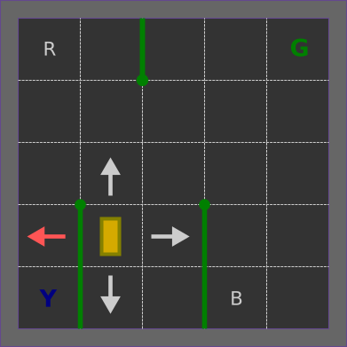

# Reinforcement Learning

Some exploration scripts and notebooks into RL world with OpenAI/gym and Keras or Pytorch.
Keras-RL is also explored along with my proper DQN implementation.

The toy example environment chosen is the `Taxi-v3` for its simplicity and the possibility to work directly with a finite length Q-table.

<center>

</center>

## Getting started
This project requires Python 3.7 and pipenv. One simple way to set this up, is to use the provided `devcontainers` spec that can be opened with VSCode or [another tool that is supporting it](https://containers.dev/supporting).
Then run
```shell
pipenv install
```
to install the required python dependencies and
```shell
pipenv shell
```
to activate the virtual environment.

Then start a training with
```shell
python debug.py
```

## Useful references
* https://towardsdatascience.com/reinforcement-learning-lets-teach-a-taxi-cab-how-to-drive-4fd1a0d00529
* https://www.learndatasci.com/tutorials/reinforcement-q-learning-scratch-python-openai-gym/
* https://levelup.gitconnected.com/build-a-taxi-driving-agent-in-a-post-apocalyptic-world-using-reinforcement-learning-machine-175b1edd8f69
* https://medium.com/@anirbans17/reinforcement-learning-for-taxi-v2-edd7c5b76869
* https://towardsdatascience.com/reinforcement-learning-explained-visually-part-4-q-learning-step-by-step-b65efb731d3e
* https://towardsdatascience.com/reinforcement-learning-explained-visually-part-5-deep-q-networks-step-by-step-5a5317197f4b